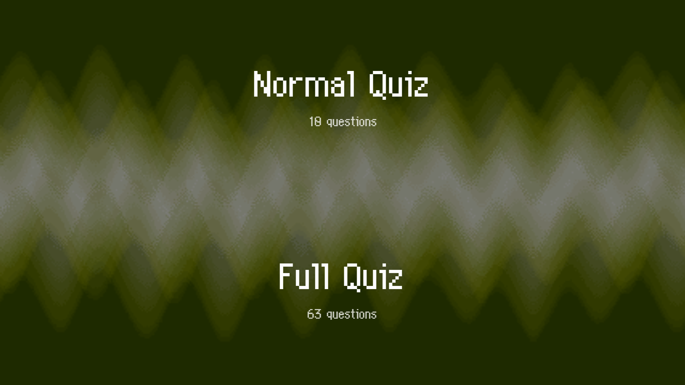
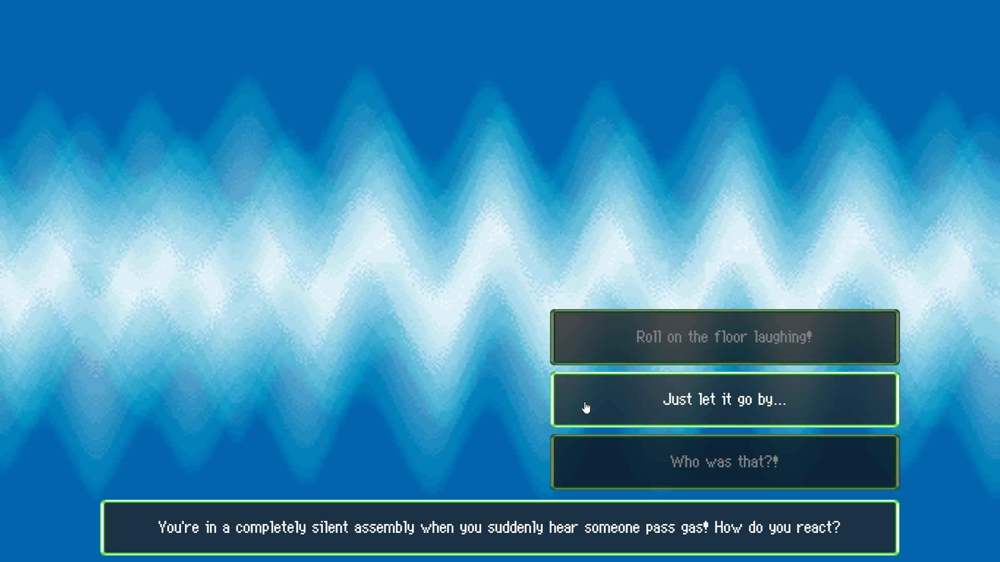
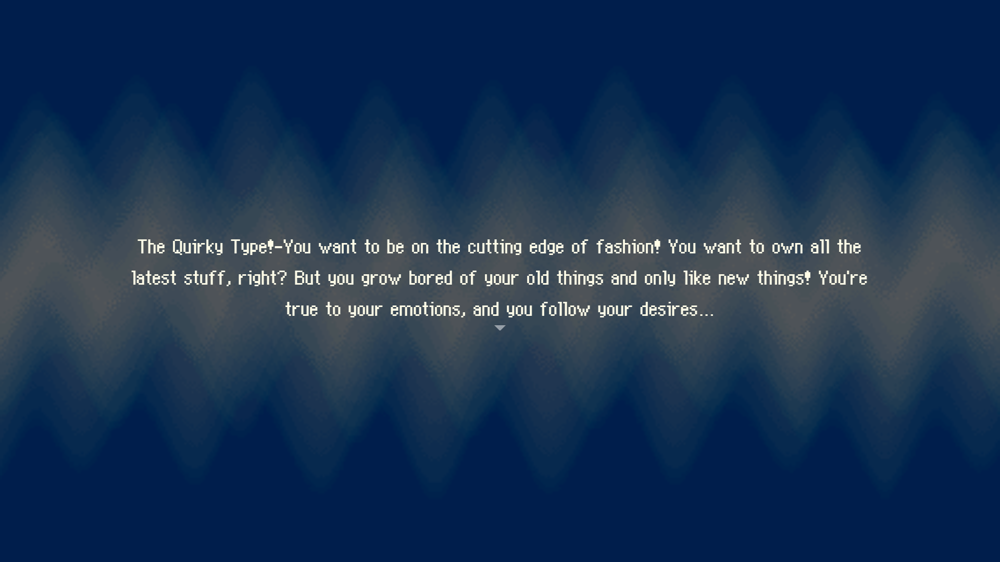
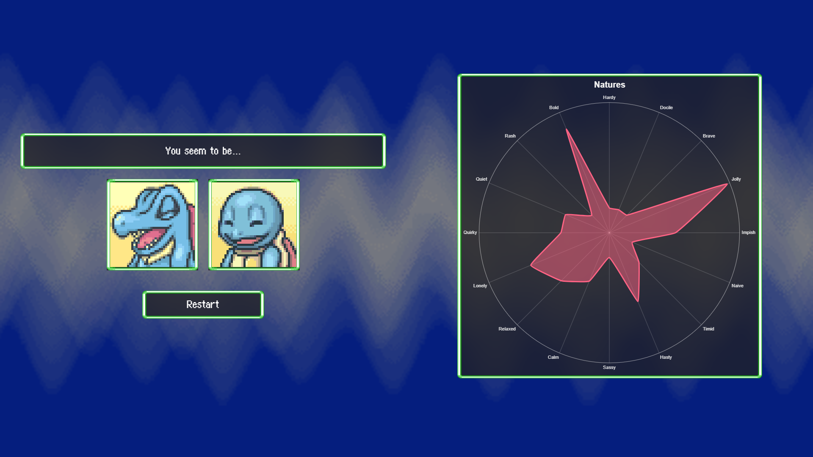

# PmdIntroQuizz

This project was generated with [Angular CLI](https://github.com/angular/angular-cli) version 14.2.8.

## Development server

Run `ng serve` for a dev server. Navigate to `http://localhost:4200/`. The application will automatically reload if you change any of the source files.

## Code scaffolding

Run `ng generate component component-name` to generate a new component. You can also use `ng generate directive|pipe|service|class|guard|interface|enum|module`.

## Build

Run `ng build` to build the project. The build artifacts will be stored in the `dist/` directory.

## Running unit tests

Run `ng test` to execute the unit tests via [Karma](https://karma-runner.github.io).

## Running end-to-end tests

Run `ng e2e` to execute the end-to-end tests via a platform of your choice. To use this command, you need to first add a package that implements end-to-end testing capabilities.

## Further help

To get more help on the Angular CLI use `ng help` or go check out the [Angular CLI Overview and Command Reference](https://angular.io/cli) page.

# Pokemon Mystery Dungeon Personality Quiz Online

## About

PMD quiz online is a litte project I did in my spare time because I love PMD and I always wanted to do this. I did it once in Unity but I didn't like the result so I decided to do it again in HTML5 using Svelte, TailwindCss and Vite as a bundler.

I have no idea of what I'm doing, I'm not a web developer, this is my second frontend project (the first one was a simple sign up form to get used to this).

Code is kind of a mess, it works, there are no bugs (that I know) and it works fine. If you want to check the code of this repo as inspiration... Please don't, give me sometime to clean it up.

## Features

- Spanish and English support (auto detect)
- The 63 original questions and natures descriptions
- Original sprites, sounds and music
- Almost identical aesthetic to the original game
- Natures radar chart (NEW)
- Two modes (Normal Quiz and Full Quiz)
- Fully responsive

## Images

|                                                 |                                                 |
| ----------------------------------------------- | ----------------------------------------------- |
|  |  |
|  |  |

## Assets used

I tried using the original assets ripped from the game to be as faithful as possible to the game while still adapting it a little to fit these times.

Althought not all assets are mine, here are the sources:

- [Font](https://www.dafont.com/fr/wonder-mail.font)
- [Questions and Natures [ES]](https://www.wikidex.net/wiki/Test_de_personalidad_de_Pokémon_Mundo_misterioso:_Exploradores_del_cielo)
- [Questions [EN]](https://gamefaqs.gamespot.com/ds/955859-pokemon-mystery-dungeon-explorers-of-sky/faqs/58014)
- [Natures [EN]](https://www.deviantart.com/sparklespeed/journal/Pokemon-Mystery-Dungeon-EoS-Nature-Descriptions-439788647)
- [Questions and Natures [FR]](https://www.pokebip.com/page/jeuxvideo/pokemon_donjon_mystere_3_explorateurs_du_ciel/questions_starter)
- Sprites were ripped from the game
- Sounds were ripped from the game
- Music was ripped from the game
